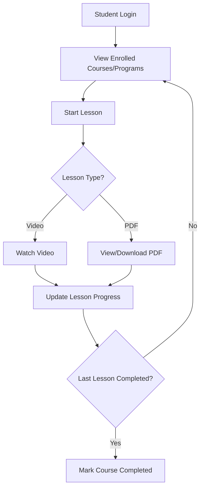
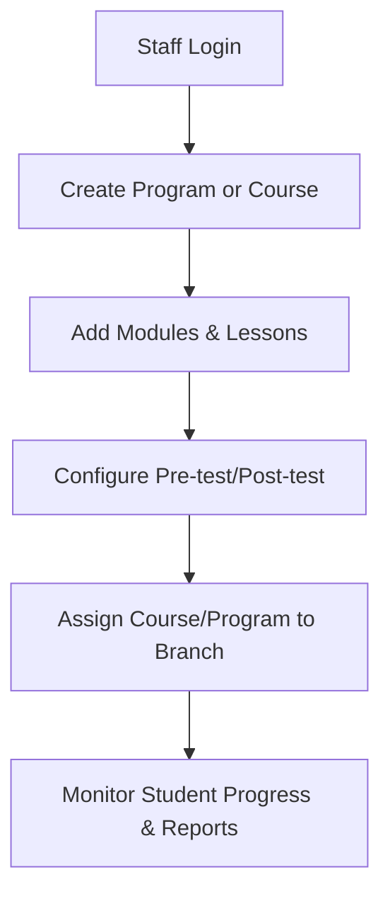
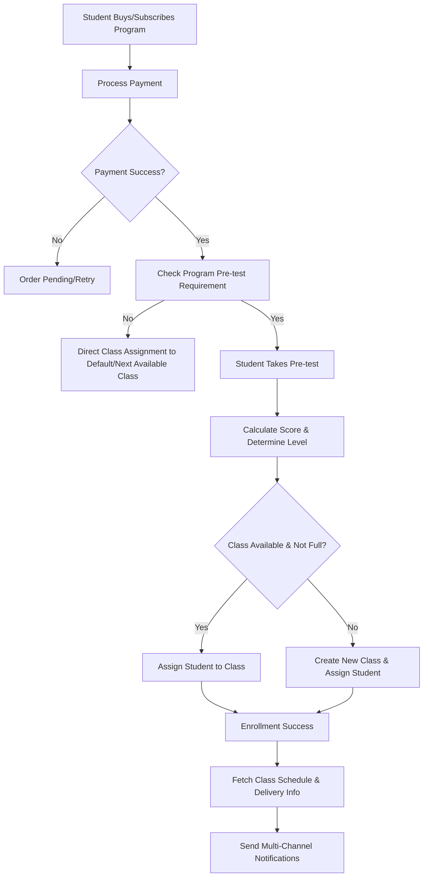
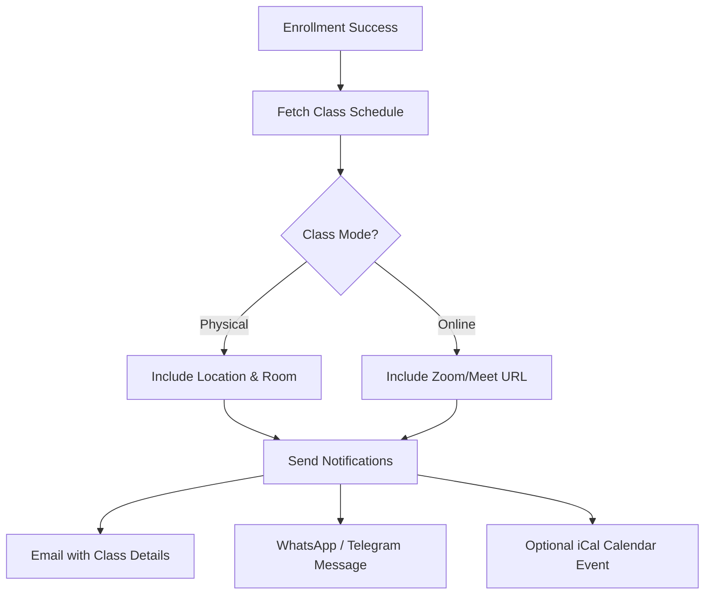
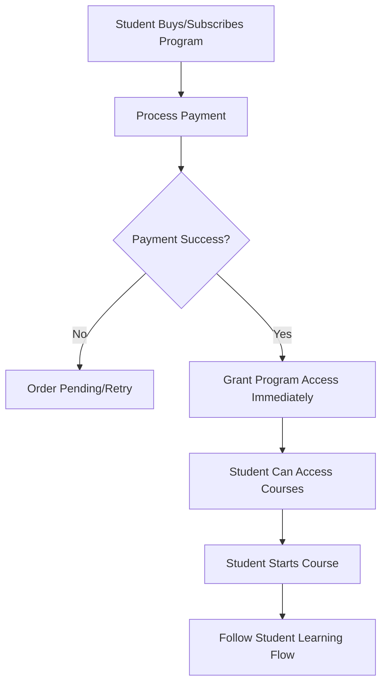
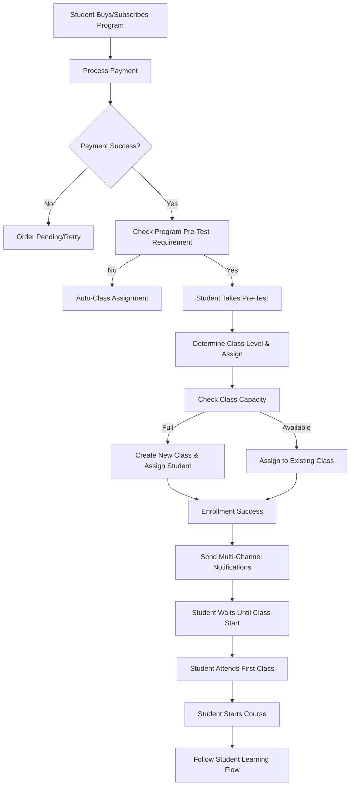
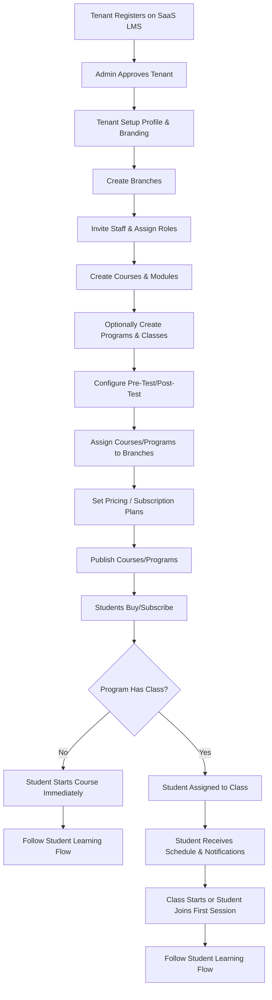

# 📘 SaaS LMS Application Documentation

---

## 1️⃣ Application Overview

The **SaaS LMS** is a **multi-tenant, multi-branch learning management system** designed for:

- **Training organizations**, **corporate academies**, and **online course providers**  
- **Subscription-based SaaS model** with **tenant isolation**  
- **Support for modular courses, programs with classes, and auto-assignment via pre-tests**  
- **Multi-channel notifications** for class schedules and updates  

**Key Highlights:**

- **Multi-tenant & multi-branch architecture**  
- **RBAC (Role-Based Access Control)** for staff and admins  
- **Branch-specific enrollments and course visibility**  
- **Program/Class system with max capacity and auto-assignment**  
- **Multi-channel notifications (Email, WhatsApp, Telegram)**  

---

## 2️⃣ Feature Modules

### 2.1 Tenant & Branch Management

- Multi-tenant with **logo, contact info, and activation status**  
- **Branch management** for localized operations  
- **Staff management** with RBAC:
  - `tenant_staff` roles (e.g., Instructor, Branch Admin)
  - Assign **branch-level or tenant-level permissions**
- **Student enrollment per branch** via `branch_student_enrollments`  

---

### 2.2 Authentication & Users

- **Secure authentication** with password hashing  
- **User types**:
  - `admin` → Global SaaS super admin
  - `tenant_staff` → Instructor / Manager
  - `student` → Learner
- **Profiles** with avatar, last login, and role mapping  
- **RBAC enforcement** with `staff_roles` & `staff_permissions`  

---

### 2.3 Courses & Learning Content

**Structure:**  
**Course → Modules → Lessons**

**Lesson Content Supports:**

- Text/HTML content  
- Video (`url` or `upload`)  
- PDF (`pdf_file_path`) for downloadable material  

**Features:**

- Modular learning paths with **progress tracking**  
- **Pre-test / Post-test** optional per **course or program**  
- **Completion triggers** when all lessons completed  

---

### 2.4 Tests & Assessments

The LMS provides **robust and flexible assessment capabilities** with **multi-section support** for professional exam design.

- **Multi-section tests** with **MCQ, essay, and multimedia questions**  
- **Flexible scoring options** for quizzes, skill tests, and standardized exams  
- **Pre-test & Post-test** functionality for **placement** and **final evaluation**  
- **Test attempt tracking**, **auto-grading** for objective questions, **manual grading** for essays or media responses  

---

#### 🏗️ Test Design Structure

Unlike traditional LMS tests that are **Test → Questions → Answers**,  
this platform uses a **section-based hierarchy** for better organization:

**Test → Sections → Questions → Answers**

- **Test**  
  - Core metadata (title, description, type: quiz, placement, evaluation)  
  - Scoring configuration (fixed, per-question, per-section, or custom logic)  

- **Sections**  
  - Logical grouping of questions (e.g., **Reading, Writing, Speaking**)  
  - Can have **individual time limits** and **section scoring rules**  
  - **Optional instruction text or media** per section  

- **Questions**  
  - Linked to a section  
  - Supports **multimedia prompts** (Text, Audio, Video, Image)  

- **Answers (Student Responses)**  
  - Supports **Text, Audio Recording, Video Recording, Image Upload**  
  - Can allow **different input types** per question for interactive assessments  

---

#### 🎯 Frontend Display Logic

- **Single-section tests**  
  - **Frontend may hide the section header** for simplicity  
  - **Questions can appear directly** for a streamlined quiz experience  
  - **Optional setting per test**: `showSectionHeader` = true/false  

- **Multi-section tests**  
  - Display sections clearly with **instructions and progress**  
  - **Section navigation** (next/prev or auto-advance)  
  - **Optional per-section timer**  

---

#### ✅ Supported Question & Answer Types

**Question Types (Prompt to Student):**  
- **Text** → Written instructions or problem statements  
- **Audio** → Listening comprehension or language prompts  
- **Video** → Scenario, role-play, or visual demonstration  
- **Image** → Diagram, chart, or visual identification  

**Answer Types (Student Response):**  
- **Text** → Short or long answers  
- **Audio Recording** → Speaking or verbal explanation  
- **Video Recording** → Presentations, role-plays, or skill demonstrations  
- **Image Upload** → Handwritten solutions, photo-based tasks  

**Example Interactive Scenarios:**  
1. **Text Question + Audio Answer** → Oral exams or speaking tests  
2. **Audio Question + Text Answer** → Listening comprehension  
3. **Video Question + Video Answer** → Practical or scenario-based assessments  
4. **Image Question + Audio/Text Answer** → Diagram interpretation  

---

#### 🏆 Flexible Scoring System

Supports multiple scoring methods to match tenant needs:

1. **Fixed Max Score (Quiz Style)**  
   - e.g., 100 points total regardless of question weights  

2. **Score Per Question (Weighted)**  
   - e.g., Q1=5 pts, Q2=10 pts, total calculated automatically  

3. **Score Per Section (TOEFL/IELTS Style)**  
   - e.g., Reading=30 pts, Speaking=30 pts, Writing=40 pts  

4. **Custom Scoring Logic (Advanced)**  
   - **Formula-based scoring** (weighted averages, penalties)  
   - **External evaluation API** for AI-assisted scoring  

---

### 2.5 Programs, Classes & E-Commerce

#### Programs

- Bundle **multiple courses**  
- Purchase via **one-time payment** or **subscription**  
- Optional **pre-test / post-test** configuration per tenant  

#### Classes

- **Programs contain many classes**  
- **Each class has max student capacity**  
- **Students auto-assigned based on pre-test score**  
  - Score thresholds determine **level/class** (Beginner/Intermediate/Advanced)  
- **Dynamic class creation** if all existing classes for a level are full  

#### Class Schedule

- **Date & Time**  
- **Day of Week** (for recurring classes)  
- **Mode**:
  - **Physical** → Address/Room  
  - **Online** → Zoom/Google Meet link  

#### Enrollment & Notification

- After **successful enrollment and class assignment**, student receives:
  - **Email confirmation** with schedule and location/Zoom link  
  - **WhatsApp / Telegram message** (if connected)  
  - **Optional iCal calendar file**  

---

## 3️⃣ SaaS Business Model & Monetization

The LMS operates as a **multi-tenant SaaS platform** with a **dual monetization strategy**:  
1. **Subscription-Based Pricing** (predictable revenue)  
2. **Usage-Based Commission** (performance-aligned revenue)

---

### 1️⃣ Subscription-Based Pricing (Baseline Revenue)

- **Tiered subscription plans** remain the core model for predictable MRR (Monthly Recurring Revenue).  
- Tiers can be defined by:
  - **Number of active students or staff users**  
  - **Storage allocation** for video, PDFs, and test data  
  - **Feature access** (advanced analytics, integrations, white-labeling)  

**Example Tiers:**

| Tier          | Monthly Price | Key Features                                        |
|---------------|--------------|----------------------------------------------------|
| **Free/Trial**| $0           | Limited courses, 1 branch, branding by SaaS         |
| **Basic**     | $49          | X active students, email notifications, basic reports |
| **Pro**       | $199         | Advanced analytics, WhatsApp/Telegram, moderate storage |
| **Enterprise**| Custom       | Unlimited students, white-label, custom domain, priority support |

---

### 2️⃣ Usage-Based Commission (Growth Revenue)

Beyond the subscription, the platform earns **commission per enrollment** or **per user activity**.  

**Commission Models:**

1. **Percentage per Enrollment**  
   - e.g., 5-10% of the course/program fee charged to end-users.  
   - Ideal if tenants sell courses to the public.  

2. **Fixed Fee per Enrollment**  
   - e.g., $1-$2 per new student enrollment.  
   - Works well for internal corporate training where prices are fixed.  

3. **Hybrid**  
   - A **small subscription fee + per-user commission**, ensuring revenue from both low and high-volume tenants.

**Advantages:**  
- **Aligns revenue with tenant success**: When tenants grow, the SaaS earns more.  
- **Lowers barrier to entry**: Tenants can start with a lower subscription but share revenue as they scale.  
- **Supports freemium-to-paid conversion**: Small tenants can start free and pay via commissions.  

---

### 💡 Recommended Implementation Flow

1. **Track Enrollments & Active Users** per tenant in real-time.  
2. **Generate Automated Usage Reports** for commission calculation.  
3. **Integrate with Billing System**:
   - Subscription invoice + commission fees on the same monthly bill.  
4. **Offer Optional Cap**:
   - Limit commission per month for high-volume enterprise clients.  

---

### 🏷️ Enterprise & White-Label Upsell

- White-labeling and enterprise support remain **premium features** under **subscription plans**.  
- Combining subscription + commission ensures **high LTV (Lifetime Value)** from large tenants.  

---

### 📊 Example Revenue Flow

- **Tenant A (Basic Plan)**: $49/month + 50 enrollments × $1/enrollment → **$99/month**  
- **Tenant B (Pro Plan)**: $199/month + 200 enrollments × $1/enrollment → **$399/month**  
- **Tenant C (Enterprise)**: $500/month + 500 enrollments × 5% of course price ($20 avg) → **$1,000+/month**

---

## 4️⃣ Core LMS Functionality & Features

### Reporting & Analytics

- **For Instructors/Tenant Admins**:
  - **Student Performance Analytics**: Show per-student and per-class performance on tests and overall progress.  
  - **Engagement Metrics**: Track how long students are spending on lessons and which lessons have the highest drop-off rates.  
  - **Course Effectiveness**: Data on test scores and completion rates to help tenants improve their course content.  

- **For SaaS Global Admin**:
  - **Tenant Health & Retention Metrics**: Track usage, number of active students per tenant, and subscription renewal rates.  

### E-Commerce Enhancements

- **Bundles & Promotions**: Allow tenants to create course bundles and offer promotional codes or discounts.  
- **Trial Periods**: Support free trials for courses or programs to drive enrollment.  

---

## 5️⃣ User Roles & Permissions

| Type          | Scope           | Example Permissions                  |
|---------------|-----------------|--------------------------------------|
| Admin         | Global SaaS     | Manage tenants, billing, reports     |
| Tenant Staff  | Tenant / Branch | Manage courses, classes, students    |
| Student       | Branch / Tenant | Access courses, take tests           |

**RBAC Highlights:**

- **Tenant-level and branch-level** permissions  
- **Sample keys**:  
  - `manage_courses`  
  - `manage_classes`  
  - `assign_students`  
  - `view_reports`  

---

## 6️⃣ Multi-Tenant Architecture

1. **Tenant Isolation** with `tenant_id` on most tables  
2. **Branch-Level Scoping** for courses, students, and reporting  
3. **Dynamic Class Assignment** handled per tenant/program  
4. **Payment Isolation** per tenant for SaaS billing  

---

## 7️⃣ Future Enhancements

- **Certificate generation** after course completion  
- **AI-powered recommendations** for class placement and learning paths  
- **Gamification** (points, badges)  
- **Integrated Chat** (student-student, student-instructor)  
  - **In-lesson commenting/questions**: Students can post questions directly on a lesson, and instructors can respond in context.  
  - **Discussion forums**: Enable asynchronous, community-based discussions within a course or program to foster peer-to-peer learning.  
- **Zoom / Video Conferencing Integration** for live classes  
- **White-label SaaS** per tenant with custom domain & branding  
- **Mobile app support** for offline learning  

---

### Automated Reminders & Smart Scheduling

- **Automated Reminders**  
  - Send class reminders **1 day** and **1 hour before class**  
- **Push Notifications**  
  - Via mobile app for schedules, updates, and reminders  
- **Student Self-Reschedule**  
  - Allow students to **move to another class** if slots are available  
- **Dynamic QR Check-In**  
  - For **physical classes** to verify attendance  
- **Recording Links for Online Classes**  
  - Provide access to recordings **after session ends**  

### Tenant Customization

- **Tenant Theme & Style Customization**  
  - Tenants can **edit the theme, colors, and landing page style** to match their branding.  

## 3️⃣ Core Application Flows

### 3.1 Student Learning Flow

### 3.2 Staff Course & Program Management Flow

### 3.3 Program Purchase & Class Auto-Assignment Flow

### 3.4 Class Notification Flow (Programs with Classes Only)

### 3.5 Student Flow: Program Without Class

**Flow Notes:**

- No class assignment is needed.  
- Student can start the course immediately after payment.  
- Progress tracking and lesson access follow the **Student Learning Flow**.

### 3.6 Student Flow: Program With Class

**Flow Notes:**

- Student cannot start learning until class assignment & schedule notification.
- If pre-test is required, class level is determined by score thresholds.
- Notifications include date, time, location/Zoom link.
- After class start, the Student Learning Flow applies.

### 3.7 Tenant Flow: From Registration to Selling Courses/Classes

