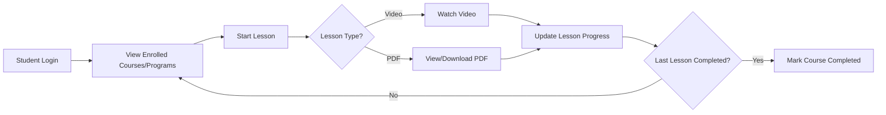
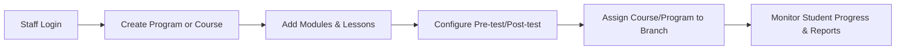
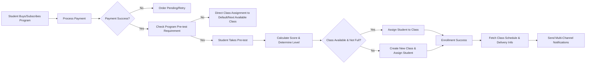
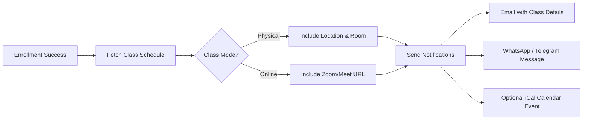

# 📘 SaaS LMS Application Documentation (Full)

---

## 1️⃣ Application Overview

The **SaaS LMS** is a **multi-tenant, multi-branch learning management system** designed for:

- **Training organizations**, **corporate academies**, and **online course providers**  
- **Subscription-based SaaS model** with **tenant isolation**  
- **Support for modular courses, programs with classes, and auto-assignment via pre-tests**  
- **Multi-channel notifications** for class schedules and updates  

**Key Highlights:**

- **Multi-tenant & multi-branch architecture**  
- **RBAC (Role-Based Access Control)** for staff and admins  
- **Branch-specific enrollments and course visibility**  
- **Program/Class system with max capacity and auto-assignment**  
- **Multi-channel notifications (Email, WhatsApp, Telegram)**  

---

## 2️⃣ Feature Modules

### 2.1 Tenant & Branch Management

- Multi-tenant with **logo, contact info, and activation status**  
- **Branch management** for localized operations  
- **Staff management** with RBAC:
  - `tenant_staff` roles (e.g., Instructor, Branch Admin)
  - Assign **branch-level or tenant-level permissions**
- **Student enrollment per branch** via `branch_student_enrollments`  

---

### 2.2 Authentication & Users

- **Secure authentication** with password hashing  
- **User types**:
  - `admin` → Global SaaS super admin
  - `tenant_staff` → Instructor / Manager
  - `student` → Learner
- **Profiles** with avatar, last login, and role mapping  
- **RBAC enforcement** with `staff_roles` & `staff_permissions`  

---

### 2.3 Courses & Learning Content

**Structure:**  
**Course → Modules → Lessons**

**Lesson Content Supports:**

- Text/HTML content  
- Video (`url` or `upload`)  
- PDF (`pdf_file_path`) for downloadable material  

**Features:**

- Modular learning paths with **progress tracking**  
- **Pre-test / Post-test** optional per **course or program**  
- **Completion triggers** when all lessons completed  

### 2.4 Tests & Assessments

- **Multi-section tests** with MCQ and Essay support  
- **Flexible scoring** (per question, per section, fixed, or custom)  
- **Pre-test & Post-test** support:
  - **Pre-test** for **program placement / class auto-assignment**  
  - **Post-test** for **final evaluation / certification**  
- **Test attempt tracking**, **auto-grading** for MCQs, and **manual grading** for essays  

---

### 2.5 Programs, Classes & E-Commerce

#### Programs

- Bundle **multiple courses**  
- Purchase via **one-time payment** or **subscription**  
- Optional **pre-test / post-test** configuration per tenant  

#### Classes

- **Programs contain many classes**  
- **Each class has max student capacity**  
- **Students auto-assigned based on pre-test score**  
  - Score thresholds determine **level/class** (Beginner/Intermediate/Advanced)  
- **Dynamic class creation** if all existing classes for a level are full  

#### Class Schedule

- **Date & Time**  
- **Day of Week** (for recurring classes)  
- **Mode**:
  - **Physical** → Address/Room  
  - **Online** → Zoom/Google Meet link  

#### Enrollment & Notification

- After **successful enrollment and class assignment**, student receives:
  - **Email confirmation** with schedule and location/Zoom link  
  - **WhatsApp / Telegram message** (if connected)  
  - **Optional iCal calendar file**  

## 3️⃣ Core Application Flows

### 3.1 Student Learning Flow

### 3.2 Staff Course & Program Management Flow

### 3.3 Program Purchase & Class Auto-Assignment Flow

### 3.4 Class Notification Flow (Programs with Classes Only)

---

## 4️⃣ User Roles & Permissions

| Type          | Scope           | Example Permissions                  |
|---------------|-----------------|--------------------------------------|
| Admin         | Global SaaS     | Manage tenants, billing, reports     |
| Tenant Staff  | Tenant / Branch | Manage courses, classes, students    |
| Student       | Branch / Tenant | Access courses, take tests           |

**RBAC Highlights:**

- **Tenant-level and branch-level** permissions  
- **Sample keys**:  
  - `manage_courses`  
  - `manage_classes`  
  - `assign_students`  
  - `view_reports`  

---

## 5️⃣ Multi-Tenant Architecture

1. **Tenant Isolation** with `tenant_id` on most tables  
2. **Branch-Level Scoping** for courses, students, and reporting  
3. **Dynamic Class Assignment** handled per tenant/program  
4. **Payment Isolation** per tenant for SaaS billing  

---

## 6️⃣ Technical Notes

- **Backend:** Node.js (NestJS / Express) or Laravel  
- **Frontend:** Nuxt 3 / React  
- **Database:** PostgreSQL (multi-tenant, class assignment logic in services)  
- **Authentication:** JWT + Refresh Token  
- **Media Storage:** S3 / GCS for video & PDFs  
- **Job Queue:** BullMQ / RabbitMQ for notifications & async tasks  
- **CDN:** For media delivery  

**Notification System:**

- **Email**: SES / SendGrid / Postmark  
- **WhatsApp**: Twilio / WhatsApp Cloud API  
- **Telegram**: Telegram Bot API  
- **Optional iCal generation** for class events  

---

## 7️⃣ Future Enhancements

- **Gamification** (points, badges)  
- **AI-powered recommendations** for class placement and learning paths  
- **Integrated Chat** (student-student, student-instructor)  
- **Zoom / Video Conferencing Integration** for live classes  
- **White-label SaaS** per tenant with custom domain & branding  
- **Mobile app support** for offline learning  
- **Automated Class Reminders** and QR-based check-ins for physical classes  
- **Certificate generation** after course completion  

